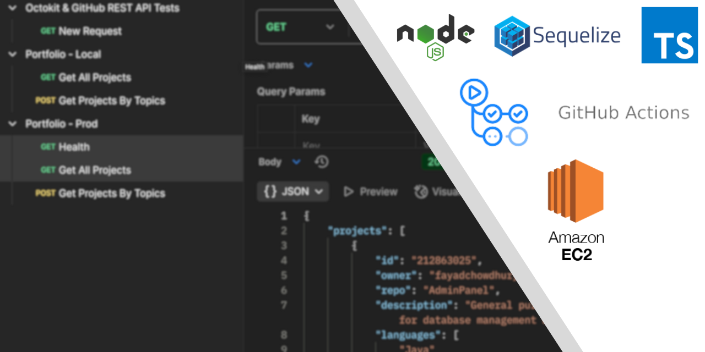

The backend for my portfolio site is built on Node, Express, TypeScript and Sequelize for an ORM.

It looks after my mailing service using Nodemailer and syncs with my Github repositories using Octokit to supply data for my site's Projects section.

It is built to be modular and while it is monolithic now, I plan on splitting it out into isolated components that I will orchestrate as microservices.

WIP!
